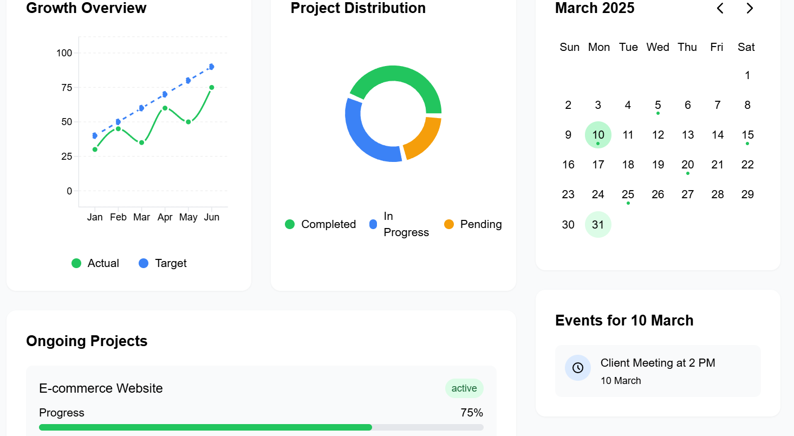
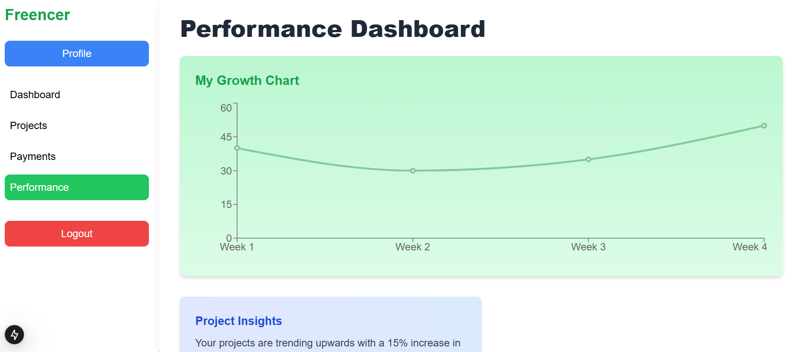
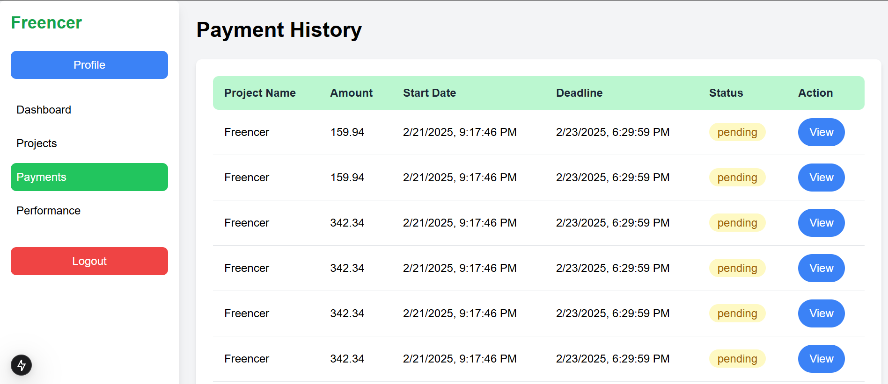
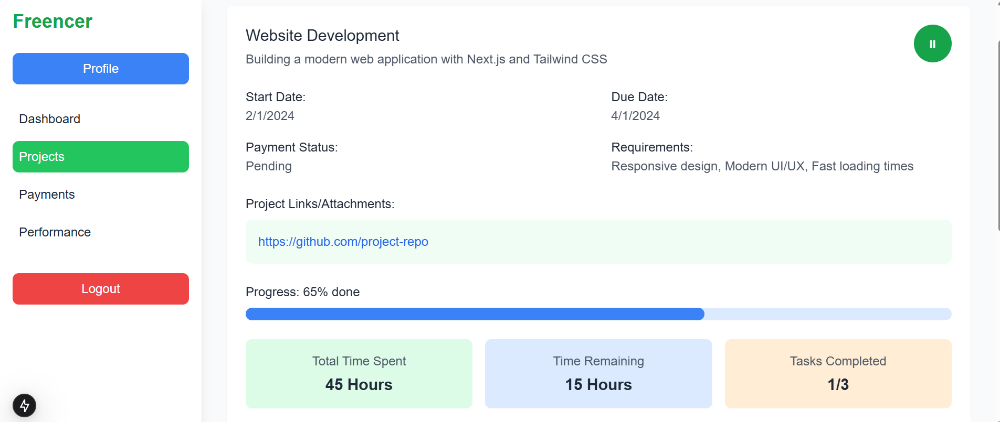
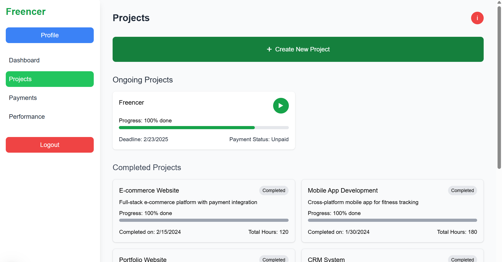

# Freelancer Web App

A platform designed to connect clients with freelancers, enabling smooth communication, project management, and contract handling. The app allows users to create profiles, manage tasks, send proposals, and track payments, all with an intuitive user interface and seamless user experience.

## **Tech Stack**

- **Next.js**: A React-based framework for building fast, server-rendered web apps with SEO optimization.
- **Tailwind CSS**: A utility-first CSS framework used for responsive and modern styling.
- **React**: A JavaScript library for building interactive UIs with reusable components.
- **Node.js**: Backend runtime for handling requests, APIs, and server-side logic.
- **MongoDB**: NoSQL database used to store user data, project information, and other app-related content.

## **Screenshots**

Here are some screenshots of the app:

*Home Page: An overview of the Freelancer web app showcasing the user dashboard.*

*Dashboard: Where users can view their active projects and status updates.*

*Payments: A section for managing invoices and transaction history.*

*Project Page: Detailed view of the individual projects with associated details.*

*Projects: Where clients and freelancers can manage ongoing and upcoming work.*
